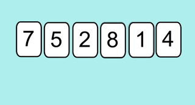

<! -- Création d'un lien vers un nouvel onglet {:target="_blank" }  
[Aide pour creer Mkdocs](https://ens-fr.gitlab.io/mkdocs/){:target="_blank" }
{: .center}-->
{: .center}

=== "Tri Sélection"

    ## 1. Animation Tri Sélection
    Considérons la liste `[5, 4, 2, 1]`  
    Voici le fonctionnement de l'algorithme :  
    {: .center}
    
    ## 2. Principe Tri Sélection
    
    !!! note "description de l'algorithme"
    Le travail se fait essentiellement sur les **indices**.
    
    - du premier élément jusqu'à l'avant-dernier :
        - on considère que cet élément est l'élément minimum, on stocke donc son indice dans une variable *indice du minimum*.
        - on parcourt les éléments suivants, et si on repère un élémént plus petit que notre mininum on met à jour notre *indice du minimum*.
        - une fois le parcours fini, on échange l'élément de travail avec l'élément minimum qui a été trouvé.
 
    ## 3. Implémentation de l'algorithme Tri Sélection
    
    !!! abstract "Tri par sélection :heart: "
        ```python
        def tri_selection(tab) :
            for k in range(len(tab)-1):
                indice_min = k
                for i in range(k+1, len(tab)) :
                    if tab[i] < tab[indice_min]:
                        indice_min = i
                # Inversion
                tmp = tab[k]
                tab[k] = tab[indice_min]
                tab[indice_min] = tmp
        ```
    [Cliquer ici pour vérifier sur PythonTutor](https://urlz.fr/izlK){target=__blank}

    *Vérification :*
    ```python
    >>> ma_liste = [7, 5, 2, 8, 1, 4]
    >>> tri_selection(ma_liste)
    >>> ma_liste
    [1, 2, 4, 5, 7, 8]
    ```

=== "Tri Insertion"

    ## 1. Animation Tri Insertion
    Considérons la liste `[7, 5, 2, 8, 1, 4]`   
    Voici le fonctionnement de l'algorithme :  
    {: .center}
    
    ## 2. Principe Tri Insertion

    !!! note "description de l'algorithme"
    - On traite successivement toutes les valeurs à trier, en commençant par celle en deuxième position.
    - Traitement : tant que la valeur à traiter est inférieure à celle située à sa gauche, on échange ces deux valeurs.

    
    ## 3. Implémentation de l'algorithme Tri Insertion
    
    !!! note "Tri par insertion (version simple) :heart:"
    ```python
    def tri_insertion1(tab):
        '''trie en place la liste tab donnée en paramètre'''
        for i in range(1, len(tab)):                 #(1)
            k = i                                    #(2)
            while k > 0 and tab[k-1] > tab[k] :      #(3)
                tab[k], tab[k-1] = tab[k-1], tab[k]  #(4)    
                k = k - 1                            #(5)   
    ```

    1. On commence à 1 et non pas à 0.
    2. On «duplique» la variable `i` en une variable `k`.  
    On se positionne sur l'élément d'indice ```k```. On va faire «reculer» cet élément tant que c'est possible. On ne touche pas à ```i```. 
    3. Tant qu'on n'est pas revenu au début de la liste et qu'il y a une valeur plus grande à gauche.
    4. On échange de place avec l'élément précédent.
    5. Notre élément est maintenant à l'indice ```k - 1```.  
    La boucle peut continuer.

    [Cliquer ici pour vérifier sur PythonTutor](https://urlz.fr/izmt){target=__blank}

    *Vérification :*

    ```python
    >>> maliste = [7, 5, 2, 8, 1, 4]
    >>> tri_insertion1(maliste)
    >>> maliste
    [1, 2, 4, 5, 7, 8]
    ```

    

[📄 Accueil](../../../../){ .md-button }


